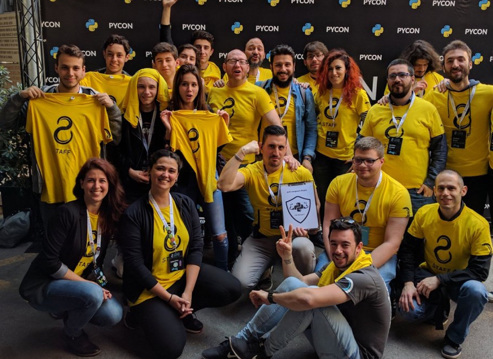

Python è la nostra passione, diffonderlo la nostra missione. Siamo Python Italia,
un’organizzazione no profit nata a Firenze nell’Aprile del 2007 dal sogno di alcuni
fan italiani del più bel linguaggio di programmazione mai creato. Da allora
siamo cresciuti in una community che conta più di 400 membri. Collaboriamo
con community simili per scambiare idee, organizzare eventi, imparare,
crescere insieme e per avere un sacco di pydivertimento!
Vuoi unirti? Manda una mail a [info@python.it](info@python.it)

